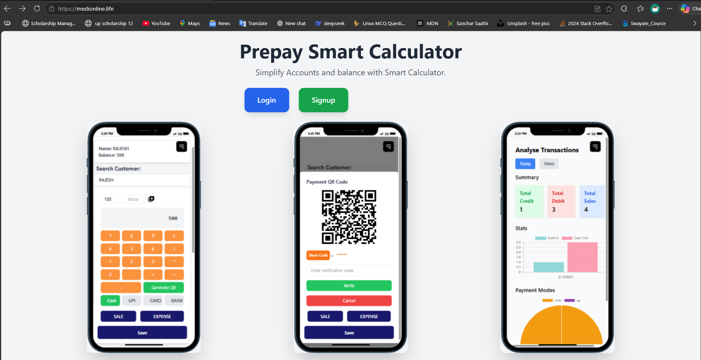
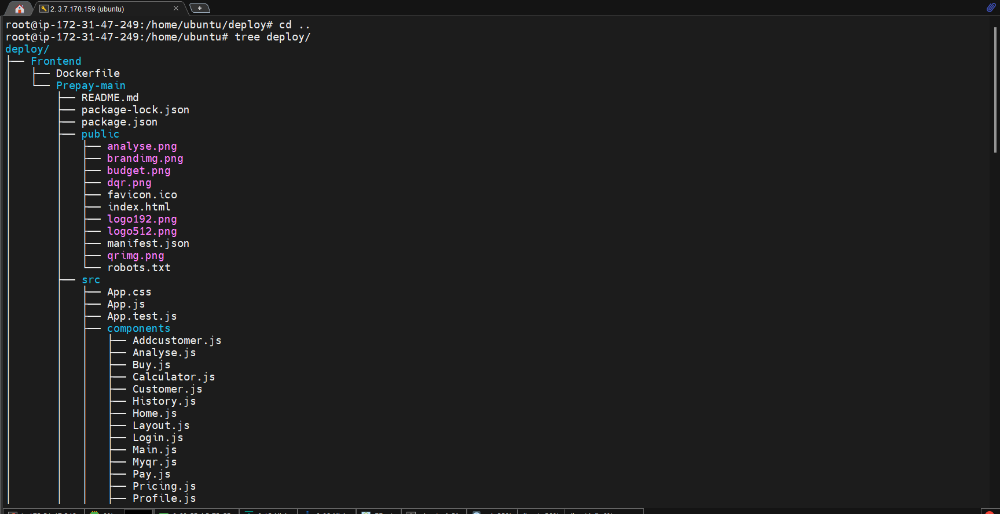
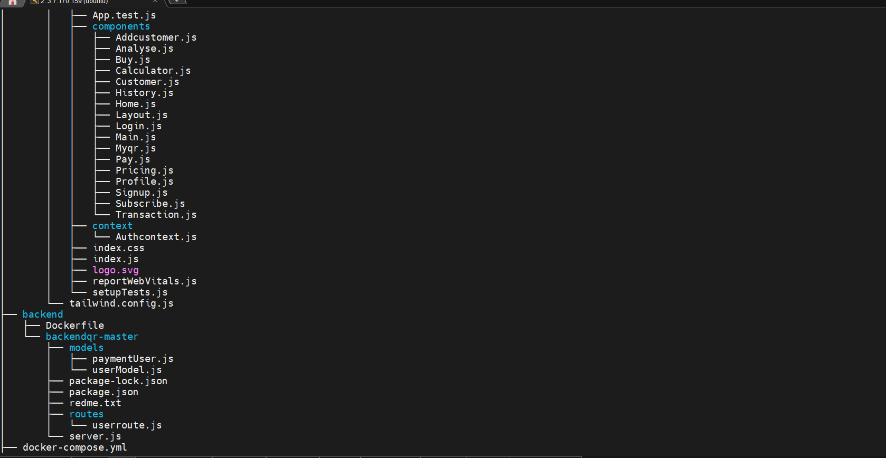
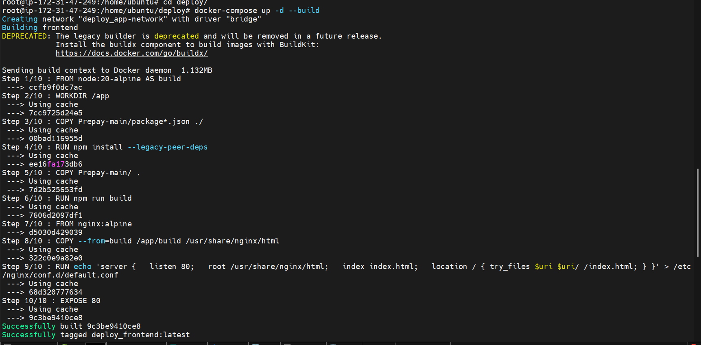

#  Prepay Smart Calculator

> Simplify Accounts and Balance with Smart Calculator

A full-stack web application for managing customer accounts, transactions, and payments with QR code generation.

---

##  Screenshots

### Home Page


### Smart Calculator


### QR Code Payment


### Transaction Analysis


---

## Features

-  **User Authentication** — Signup & Login
-  **Customer Management** — Add, Edit, Delete customers
-  **Smart Calculator** — Calculate bills with discount support
-  **QR Code Generation** — Generate payment QR codes
-  **Transaction Analysis** — Charts and stats for Today/Week
-  **Balance Tracking** — Track customer balances automatically
-  **Multiple Payment Modes** — Cash, UPI, Card, Bank
-  **Sales & Expense Tracking** — Separate sale and expense entries
-  **Profile Management** — Update user profile and UPI ID

---

##  Tech Stack

### Frontend
| Technology | Purpose |
|---|---|
| React 19 | UI Framework |
| React Router DOM v7 | Navigation |
| Tailwind CSS | Styling |
| Axios | API calls |
| Chart.js | Transaction graphs |
| QRCode.react | QR code generation |
| React Hook Form | Form handling |
| React Icons | Icons |

### Backend
| Technology | Purpose |
|---|---|
| Node.js | Runtime |
| Express.js | Web framework |
| MongoDB Atlas | Database |
| Mongoose | ODM |
| bcrypt | Password hashing |
| CORS | Cross-origin requests |
| dotenv | Environment variables |

### DevOps & Infrastructure
| Technology | Purpose |
|---|---|
| AWS EC2 | Cloud server |
| Docker | Containerization |
| Docker Compose | Multi-container management |
| Nginx | Reverse proxy + SSL |
| Let's Encrypt | Free SSL certificate |
| GoDaddy | Domain management |

---

##  Architecture

```
Internet
    ↓
https://medionline.life (GoDaddy DNS)
    ↓
AWS EC2 Server (t2.medium)
    ↓
Nginx (Reverse Proxy + SSL)
    ↙              ↘
Frontend          Backend
(React)          (Node.js)
Port 80          Port 5000
                    ↓
             MongoDB Atlas
             (Cloud Database)
```

---

##  Project Structure

```
deploy/
├── docker-compose.yml
├── nginx/
│   └── nginx.conf
├── Frontend/
│   ├── Dockerfile
│   └── Prepay-main/
│       ├── public/
│       ├── src/
│       │   ├── components/
│       │   │   ├── Calculator.js
│       │   │   ├── Customer.js
│       │   │   ├── Transaction.js
│       │   │   ├── Analyse.js
│       │   │   ├── Profile.js
│       │   │   ├── Login.js
│       │   │   ├── Signup.js
│       │   │   └── ...
│       │   ├── context/
│       │   │   └── Authcontext.js
│       │   └── App.js
│       └── package.json
└── backend/
    ├── Dockerfile
    └── backendqr-master/
        ├── models/
        │   ├── userModel.js
        │   └── paymentUser.js
        ├── routes/
        │   └── userroute.js
        ├── server.js
        └── package.json
```

---

##  Local Development Setup

### Prerequisites
- Node.js 20+
- MongoDB Atlas account
- Git

### 1. Clone the repository
```bash
git clone https://github.com/YOUR_USERNAME/YOUR_REPO.git
cd YOUR_REPO
```

### 2. Setup Backend
```bash
cd backend/backendqr-master
npm install
```

Start backend:
```bash
node server.js
```

### 3. Setup Frontend
```bash
cd Frontend/Prepay-main
npm install
npm start
```

App runs on `http://localhost:3000`

---

##  Docker Deployment

### Prerequisites
- Docker
- Docker Compose

### Run with Docker Compose
```bash
# Clone repo
git clone https://github.com/YOUR_USERNAME/YOUR_REPO.git
cd YOUR_REPO

# Create .env file
nano backend/backendqr-master/.env

# Build and start
docker-compose up -d --build

# Check containers
docker ps
```

---

##  Production Deployment (AWS)

### Infrastructure Used
- **Server:** AWS EC2 t2.medium (Ubuntu 22.04)
- **Domain:** GoDaddy
- **SSL:** Let's Encrypt (auto-renews)
- **Database:** MongoDB Atlas (free tier)

### Deployment Steps
1. Launch EC2 instance
2. Install Docker & Docker Compose
3. Clone repository
4. Create `.env` with MongoDB URI
5. Run `docker-compose up -d --build`
6. Configure SSL with Certbot
7. Point domain to EC2 Elastic IP

Full deployment guide: [See deployment docs](#)

---


##  Security Features

-  HTTPS with SSL certificate
-  Password hashing with bcrypt
-  CORS protection
-  Environment variables for secrets
-  Docker container isolation
-  Nginx as security layer

---

##  Live URLs

| Service | URL |
|---|---|
|  Frontend | https://medionline.life |
|  Backend API | https://api.medionline.life |

---

##  Contributing

1. Fork the repository
2. Create your feature branch (`git checkout -b feature/AmazingFeature`)
3. Commit your changes (`git commit -m 'Add some AmazingFeature'`)
4. Push to the branch (`git push origin feature/AmazingFeature`)
5. Open a Pull Request

---

##  License

This project is licensed under the ISC License.

---

## Author

**Your Name**
- GitHub: [@your-username](https://github.com/your-username)
- Live App: [medionline.life](https://medionline.life)

---
##  Live Services

 **Note:** Different domains are used for frontend and backend because this project is deployed for        testing and learning purposes.  
    This setup also mimics real-world production architecture where services are separated (e.g., frontend domain + API subdomain).

- Frontend: https://medionline.life  
- Backend: https://api.medionline.life  

---

 If you found this project useful, please give it a star!
